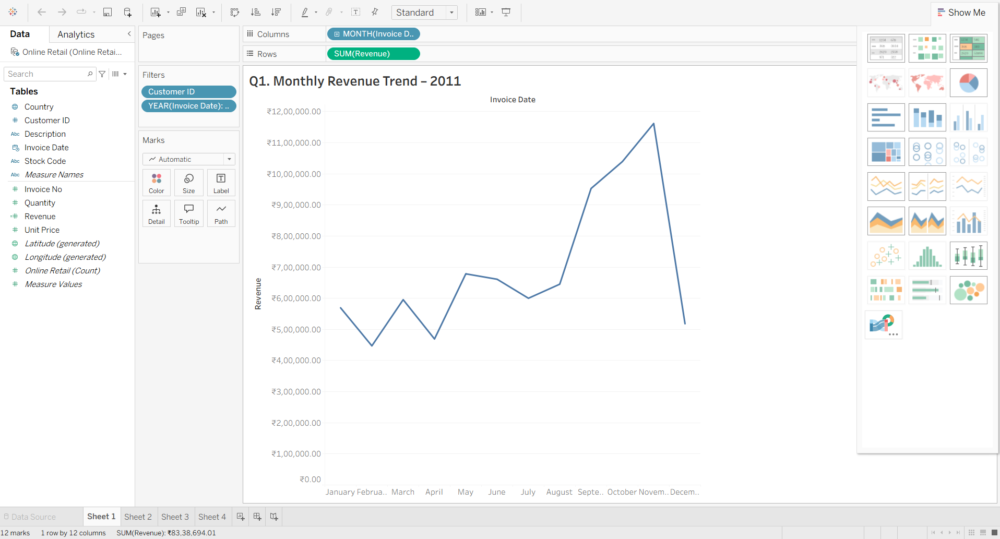

# Online Retail Analysis – Tableau Dashboard by Priyanshi

This interactive Tableau dashboard presents a comprehensive analysis of an online retail dataset. It was built to understand customer patterns, product performance, and revenue distribution across different segments.

## 🔍 Key Insights
- Monthly and yearly sales trends
- Top-performing products and categories
- Regional sales comparison
- Customer segmentation using filters and KPIs

## 🎯 Goal
To practice data visualization skills and apply business intelligence concepts using real-world retail data.

## 🛠 Tools Used
- Tableau (for dashboard creation)
- Excel (for data cleaning and preparation)

## 📁 File Included
- [📊 Online Retail Analysis – Priyanshi.twbx](Online%20Retail%20Analysis%20–%20Priyanshi.twbx) – Tableau workbook with interactive visuals

  

